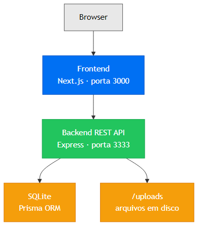
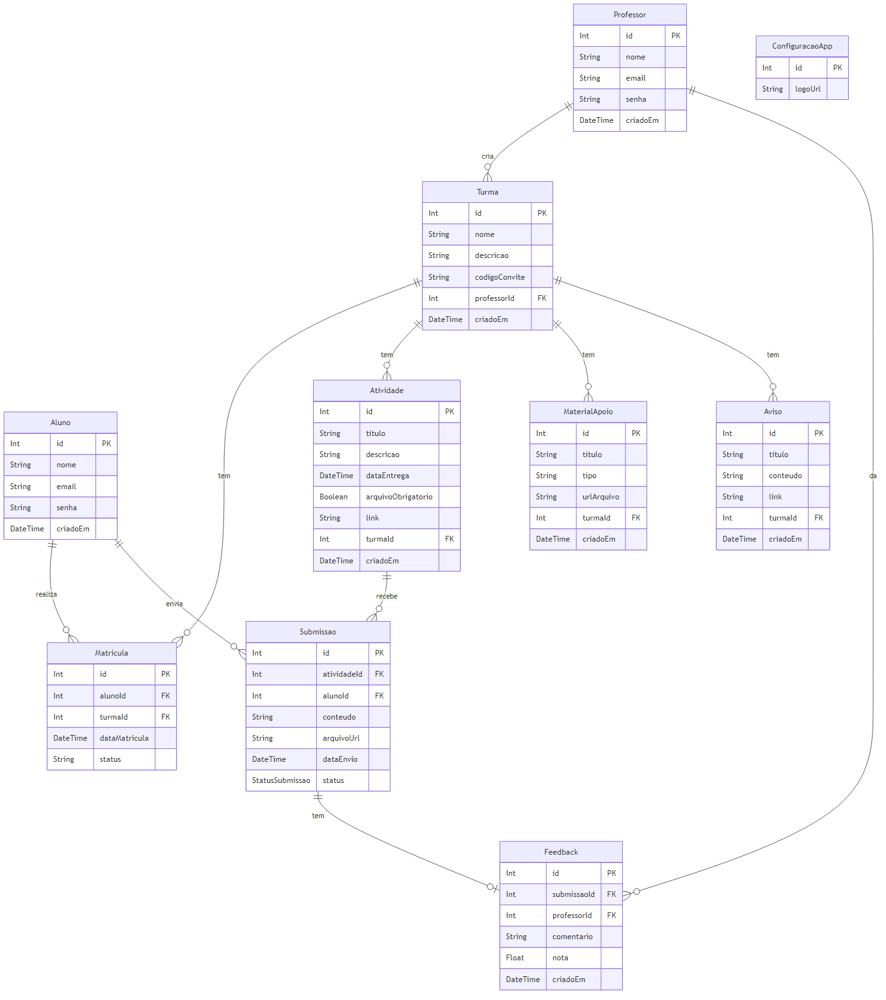
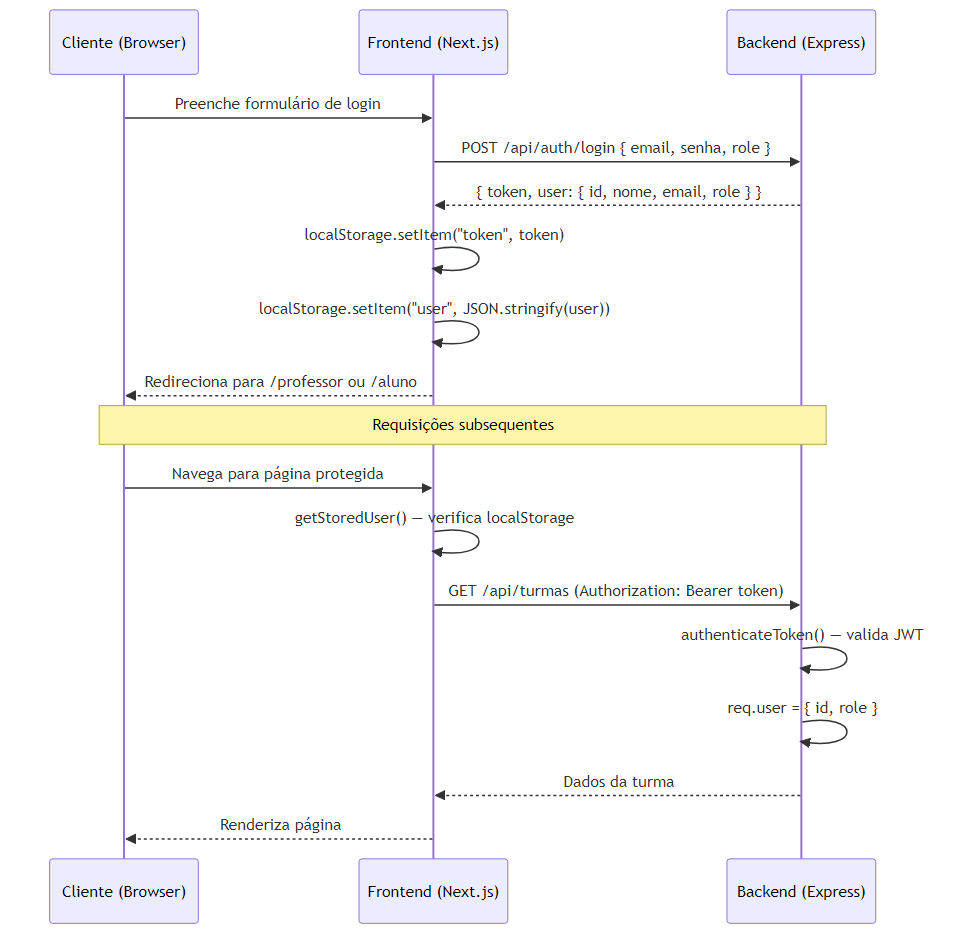

# Arquitetura — Sweet Way English

Documentação arquitetural da plataforma educacional **Sweet Way English**, desenvolvida como projeto prático de TCC full-stack. O sistema conecta professores e alunos para o aprendizado de inglês, oferecendo gestão de turmas, atividades, submissões e feedbacks.

---

## 1. Visão Geral



O frontend é uma SPA/SSR Next.js que consome a API REST do backend. Toda comunicação é feita via HTTP com autenticação por JWT. O backend persiste dados em um banco SQLite local gerenciado pelo Prisma ORM e armazena arquivos enviados (submissões, materiais, logo) no diretório `uploads/` do servidor.

---

## 2. Backend

**Stack:** Node.js · Express 4 · TypeScript (ESM) · Prisma ORM · SQLite (`better-sqlite3`) · JWT · Multer · Zod · Vitest

### 2.1 Estrutura de Pastas

```
backend/
├── prisma/
│   ├── schema.prisma          # Definição do banco de dados
│   ├── dev.db                 # Banco SQLite (gerado)
│   └── seed.ts                # Seed com dados iniciais
├── uploads/                   # Arquivos enviados pelos usuários
└── src/
    ├── server.ts              # Bootstrap do Express, CORS, static /uploads
    ├── config/
    │   └── multer.ts          # Configuração do Multer (armazenamento de arquivos)
    ├── database/
    │   ├── client.ts          # Instância singleton do Prisma Client
    │   └── generated/prisma/  # Cliente Prisma gerado (não editar)
    ├── types/
    │   └── index.ts           # Tipos globais (AuthRequest com req.user)
    ├── http/
    │   ├── middlewares/
    │   │   └── auth.ts        # authenticateToken() — valida JWT e popula req.user
    │   ├── controllers/       # Lógica de negócio por domínio
    │   │   ├── AuthController.ts
    │   │   ├── ClassController.ts
    │   │   ├── ActivityController.ts
    │   │   ├── SubmissionController.ts
    │   │   ├── FeedbackController.ts
    │   │   ├── MaterialController.ts
    │   │   ├── StudentController.ts
    │   │   ├── AvisoController.ts
    │   │   └── ConfigController.ts
    │   └── routes/
    │       ├── index.ts       # Agrega todos os routers sob /api
    │       ├── auth.routes.ts
    │       ├── class.routes.ts
    │       ├── activity.routes.ts
    │       ├── submission.routes.ts
    │       ├── feedback.routes.ts
    │       ├── material.routes.ts
    │       ├── student.routes.ts
    │       ├── aviso.routes.ts
    │       └── admin.routes.ts
    └── __tests__/
        ├── helpers/
        │   └── mockReqRes.ts  # Utilitários mockReq(), mockRes(), studentReq()
        ├── unit/              # Testes unitários de controllers e middlewares
        └── integration/       # Testes de integração com supertest
```

### 2.2 Rotas da API

Todas as rotas estão sob o prefixo `/api`. Rotas autenticadas exigem o header `Authorization: Bearer <token>`.

#### Autenticação (públicas)

| Método | Rota | Descrição |
|--------|------|-----------|
| `POST` | `/api/auth/register/professor` | Cadastrar professor |
| `POST` | `/api/auth/register/aluno` | Cadastrar aluno |
| `POST` | `/api/auth/login` | Login — retorna `{ token, user }` |

#### Turmas

| Método | Rota | Descrição | Papel |
|--------|------|-----------|-------|
| `GET` | `/api/turmas` | Listar turmas do usuário | Professor/Aluno |
| `POST` | `/api/turmas` | Criar turma | Professor |
| `GET` | `/api/turmas/:id` | Detalhe da turma (atividades, materiais, avisos) | Ambos |
| `POST` | `/api/turmas/entrar` | Aluno entra via código de convite | Aluno |

#### Atividades

| Método | Rota | Descrição | Papel |
|--------|------|-----------|-------|
| `GET` | `/api/turmas/:turmaId/atividades` | Listar atividades da turma | Ambos |
| `POST` | `/api/turmas/:turmaId/atividades` | Criar atividade | Professor |
| `PATCH` | `/api/professor/atividades/:id` | Atualizar atividade | Professor |

#### Avisos

| Método | Rota | Descrição | Papel |
|--------|------|-----------|-------|
| `GET` | `/api/turmas/:turmaId/avisos` | Listar avisos da turma | Ambos |
| `POST` | `/api/turmas/:turmaId/avisos` | Criar aviso | Professor |
| `DELETE` | `/api/turmas/:turmaId/avisos/:avisoId` | Remover aviso | Professor |

#### Materiais de Apoio

| Método | Rota | Descrição | Papel |
|--------|------|-----------|-------|
| `GET` | `/api/turmas/:id/materiais` | Listar materiais da turma | Ambos |
| `POST` | `/api/turmas/:id/materiais` | Upload de material (multipart) | Professor |
| `DELETE` | `/api/turmas/:id/materiais/:materialId` | Remover material | Professor |

#### Submissões

| Método | Rota | Descrição | Papel |
|--------|------|-----------|-------|
| `POST` | `/api/atividades/:id/submissoes` | Enviar submissão (campo `arquivo`) | Aluno |
| `GET` | `/api/atividades/:id/submissoes` | Listar submissões da atividade | Professor |
| `PATCH` | `/api/professor/submissoes/:id` | Atualizar status da submissão | Professor |

#### Feedback

| Método | Rota | Descrição | Papel |
|--------|------|-----------|-------|
| `POST` | `/api/submissoes/:id/feedback` | Adicionar feedback a uma submissão | Professor |
| `GET` | `/api/alunos/me/feedbacks` | Listar feedbacks do aluno logado | Aluno |

#### Alunos (gestão pelo professor)

| Método | Rota | Descrição | Papel |
|--------|------|-----------|-------|
| `GET` | `/api/professor/alunos` | Listar todos os alunos | Professor |
| `POST` | `/api/professor/alunos` | Criar aluno | Professor |
| `PATCH` | `/api/professor/alunos/:id` | Atualizar aluno | Professor |
| `DELETE` | `/api/professor/alunos/:id` | Remover aluno | Professor |

#### Configurações e Perfil

| Método | Rota | Descrição | Auth |
|--------|------|-----------|------|
| `GET` | `/api/configuracoes` | Obter configurações da plataforma (logo) | Não |
| `PATCH` | `/api/configuracoes/logo` | Upload de logo (multipart `logo`) | Sim |
| `GET` | `/api/professor/me` | Perfil do professor logado | Sim |
| `PATCH` | `/api/professor/me` | Atualizar perfil do professor | Sim |

#### Admin

| Método | Rota | Descrição |
|--------|------|-----------|
| `GET` | `/api/admin/professores` | Listar professores |
| `POST` | `/api/admin/professores` | Criar professor |
| `PATCH` | `/api/admin/professores/:id` | Atualizar professor |
| `DELETE` | `/api/admin/professores/:id` | Remover professor |
| `POST` | `/api/admin/alunos/:id/promover` | Promover aluno a professor |

#### Utilitário

| Método | Rota | Descrição |
|--------|------|-----------|
| `GET` | `/api/health` | Health check |

---

## 3. Modelo de Dados

O banco é SQLite gerenciado pelo Prisma. O schema está em `backend/prisma/schema.prisma` e o cliente é gerado em `src/database/generated/prisma/`.

### 3.1 Diagrama Entidade-Relacionamento



### 3.2 Descrição dos Modelos

| Modelo | Descrição |
|--------|-----------|
| `Professor` | Usuário com papel de professor. Cria turmas e dá feedback. |
| `Aluno` | Usuário com papel de aluno. Entra em turmas e envia submissões. |
| `Turma` | Sala de aula com código de convite único (`codigoConvite`, 6 chars aleatórios). |
| `Matricula` | Relacionamento N:N entre `Aluno` e `Turma`. Combinação `(alunoId, turmaId)` é única. |
| `Atividade` | Tarefa associada a uma turma. Campo `arquivoObrigatorio` define se o envio de arquivo é exigido. |
| `Submissao` | Resposta do aluno a uma atividade. Status: `pendente \| aprovado \| reprovado \| corrigido`. |
| `Feedback` | Avaliação 1:1 com `Submissao`. Contém nota (`Float`) e comentário. |
| `MaterialApoio` | Recurso de apoio da turma. Tipo: `pdf \| audio \| video \| link`. |
| `Aviso` | Comunicado do professor para a turma. Pode conter link externo. |
| `ConfiguracaoApp` | Registro único (id=1) com a URL do logo da plataforma. |

> **Atenção:** `Professor` e `Aluno` são tabelas separadas, não uma tabela única com coluna de papel. O papel (`role`) é codificado no payload do JWT e distinguido pelo middleware `requireRole`.

---

## 4. Autenticação

### 4.1 Fluxo Completo



### 4.2 Middleware de Autenticação (`src/http/middlewares/auth.ts`)

- `authenticateToken` — verifica o Bearer token, decodifica o JWT e popula `req.user = { id, role }`
- `requireRole("professor" | "aluno")` — rejeita com 403 se o papel não corresponder

**Segredo JWT:** `process.env.JWT_SECRET ?? 'sweet-way-secret-key'`

---

## 5. Frontend

**Stack:** Next.js 16 · React 19 · TypeScript 5 · Tailwind CSS 4 · App Router

Sem biblioteca de estado global — todo estado é local via hooks React + `localStorage`. Sem middleware Next.js para auth — cada página/layout faz sua própria verificação em `useEffect`.

### 5.1 Estrutura de Pastas

```
frontend/src/
├── app/
│   ├── layout.tsx                      # Root layout (fontes Geist, metadata global)
│   ├── page.tsx                        # Redireciona / → /home
│   └── (main)/                         # Route group com layout compartilhado
│       ├── home/page.tsx               # Landing page pública
│       ├── login/page.tsx              # Formulário de login (?tipo=aluno|professor)
│       ├── professor/                  # Área restrita ao professor
│       │   ├── layout.tsx              # Verifica auth + TeacherNav
│       │   ├── page.tsx                # Dashboard do professor
│       │   ├── turmas/
│       │   │   ├── page.tsx            # Lista de turmas
│       │   │   ├── nova/page.tsx       # Formulário: criar turma
│       │   │   └── [id]/page.tsx       # Detalhe da turma
│       │   ├── atividade/
│       │   │   └── nova/page.tsx       # Formulário: criar atividade
│       │   ├── alunos/page.tsx         # CRUD de alunos
│       │   ├── materiais/page.tsx      # Gerenciar materiais de apoio
│       │   └── configuracoes/page.tsx  # Configurações da plataforma (logo)
│       └── aluno/                      # Área restrita ao aluno
│           ├── layout.tsx              # Verifica auth + StudentNav
│           ├── page.tsx                # Dashboard do aluno
│           ├── turmas/
│           │   ├── page.tsx            # Turmas matriculadas
│           │   └── [id]/page.tsx       # Detalhe da turma (avisos, atividades)
│           ├── atividades/
│           │   └── [id]/page.tsx       # Detalhe + envio de submissão
│           ├── materiais/page.tsx      # Visualizar materiais de apoio
│           └── feedbacks/page.tsx      # Ver feedbacks recebidos
├── components/
│   ├── Button.tsx          # Polimórfico (<button> ou <Link>), variantes: primary|secondary|ghost
│   ├── Navbar.tsx          # Barra superior, variante: home|dashboard
│   ├── NavbarAuth.tsx      # Navbar para páginas públicas
│   ├── NavbarUser.tsx      # Avatar/nome do usuário com dropdown de logout
│   ├── TeacherNav.tsx      # Navegação inferior do professor
│   ├── StudentNav.tsx      # Navegação inferior do aluno
│   ├── FiltroLista.tsx     # Campo de busca e filtro de listas
│   ├── AssetPreview.tsx    # Preview inline de PDF/áudio/vídeo
│   └── AlternatingTitle.tsx # Título animado da landing page
├── lib/
│   ├── api.ts              # apiFetch(), getToken(), assetUrl(), apiPaths
│   ├── assetPreviewKind.ts # Detecta tipo de arquivo pela URL/extensão
│   └── timePt.ts           # Formatação de datas em pt-BR
└── styles/
    └── globals.css         # Estilos globais e variáveis CSS (cor primária #8A4FF7)
```

### 5.2 Mapa de Páginas por Papel

```
Público                  Professor                          Aluno
──────────────────       ──────────────────────────────     ──────────────────────────
/home                    /professor                         /aluno
/login?tipo=professor    /professor/turmas                  /aluno/turmas
/login?tipo=aluno        /professor/turmas/nova             /aluno/turmas/[id]
                         /professor/turmas/[id]             /aluno/atividades/[id]
                         /professor/atividade/nova          /aluno/materiais
                         /professor/alunos                  /aluno/feedbacks
                         /professor/materiais
                         /professor/configuracoes
```

### 5.3 Camada de API (`src/lib/api.ts`)

Todas as chamadas ao backend passam por `apiFetch(path, init?)`:

- Prefixa `NEXT_PUBLIC_API_URL + /api` ao caminho (ex: `apiFetch("/turmas")` → `http://localhost:3333/api/turmas`)
- Injeta `Authorization: Bearer <token>` automaticamente via `localStorage`
- Define `Content-Type: application/json` para corpos não-FormData (omite para uploads, deixando o browser definir o boundary multipart)
- Retorna o `Response` bruto — o chamador verifica `res.ok` e chama `res.json()`

`assetUrl(path)` converte caminhos relativos do backend (ex: `/uploads/file.jpg`) em URLs completas para uso em `` e links de download.

### 5.4 Padrão de Busca de Dados

Páginas buscam dados no mount via `useEffect` com flag de cancelamento:

```typescript
useEffect(() => {
  let cancelled = false;
  (async () => {
    const res = await apiFetch("/turmas");
    if (cancelled) return;
    const data = await res.json();
    setTurmas(data);
  })();
  return () => { cancelled = true; };
}, []);
```

Múltiplas requisições independentes usam `Promise.all`. Atualizações de estado em lote usam `queueMicrotask`.

---

## 6. Infraestrutura (Docker Compose)

O `docker-compose.yml` na raiz do projeto define dois serviços:

```
┌─────────────────────────────────────────────┐
│              docker-compose.yml             │
│                                             │
│  ┌──────────────┐      ┌────────────────┐   │
│  │   backend    │      │   frontend     │   │
│  │  :3333       │◄─────│  :3000         │   │
│  │              │      │                │   │
│  │  SQLite      │      │ NEXT_PUBLIC_   │   │
│  │  /uploads    │      │ API_URL=:3333  │   │
│  └──────────────┘      └────────────────┘   │
└─────────────────────────────────────────────┘
```

- **`backend`**: build de `./backend`, porta `3333`. Volumes para `prisma/dev.db` e `uploads/`. Healthcheck em `GET /api/health`. Executa `prisma migrate deploy && db:seed && node dist/server.js`.
- **`frontend`**: build de `./frontend`, porta `3000`. Depende do backend estar `healthy`. Recebe `NEXT_PUBLIC_API_URL` como build arg.

**Variáveis de ambiente relevantes** (arquivo `.env` na raiz):

| Variável | Descrição |
|----------|-----------|
| `JWT_SECRET` | Segredo para assinar/verificar tokens JWT |
| `APP_URL` | URL pública do backend |
| `NEXT_PUBLIC_API_URL` | URL do backend usada pelo frontend em build time |
| `GEMINI_API_KEY` | Chave da API Gemini (funcionalidades de IA) |

---

## 7. Testes

### Backend — Vitest

| Tipo | Localização | Estratégia |
|------|-------------|------------|
| Unitário | `src/__tests__/unit/controllers/` | Instancia o controller diretamente, usa `mockReq()`/`mockRes()` sem subir o Express |
| Unitário | `src/__tests__/unit/middlewares/` | Testa `authenticateToken` com tokens válidos/inválidos |
| Integração | `src/__tests__/integration/app.test.ts` | Usa `supertest` sobre o app Express real |

```bash
cd backend
npm test                                    # Todos os testes
npx vitest run src/__tests__/unit/controllers/AuthController.test.ts  # Arquivo único
npm run test:coverage                       # Relatório de cobertura (HTML em coverage/)
```

### Frontend — Jest + Playwright

| Tipo | Localização | Descrição |
|------|-------------|-----------|
| Unitário | `src/` (não existem ainda) | Jest + Testing Library (configurado, sem testes ainda) |
| E2E | `e2e/no-errors.spec.ts` | Verifica páginas públicas: sem erros de console, HTTP 200, sem imagens quebradas |

```bash
cd frontend
npm run test:e2e                            # Todos os specs Playwright
npx playwright test e2e/no-errors           # Spec específico
npm run test:e2e:ui                         # Modo interativo (debug visual)
```

> O E2E exige o frontend rodando em `localhost:3000`. O Playwright está configurado para iniciar o servidor automaticamente via `webServer` no `playwright.config.ts`.
